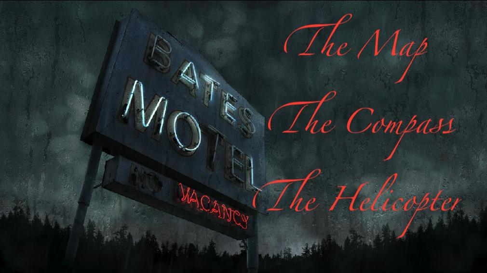
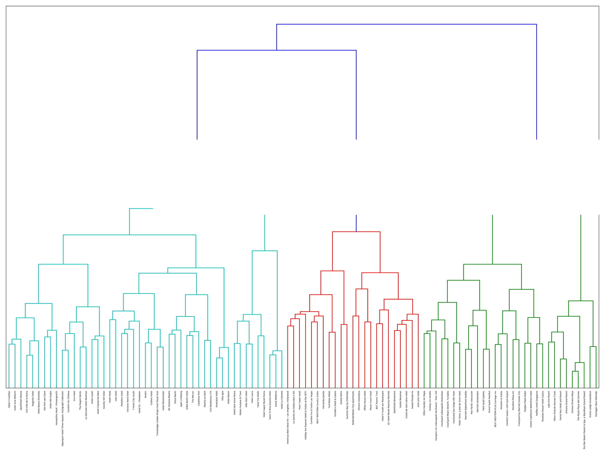
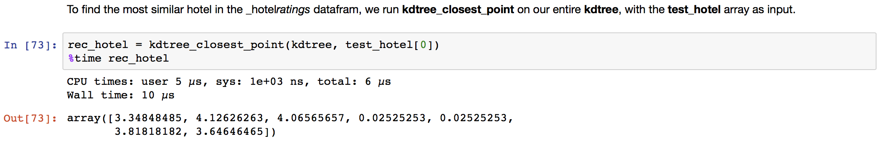
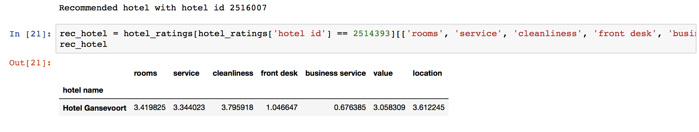
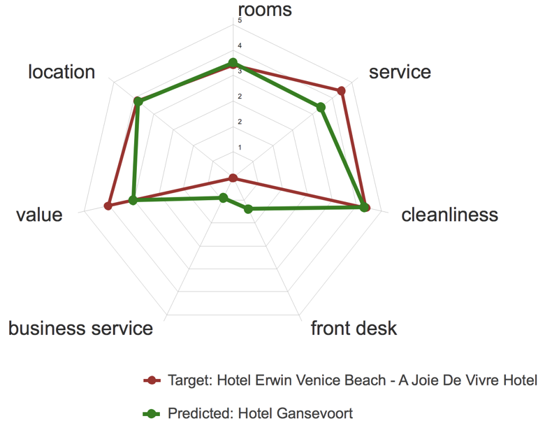

# Hotel Recommender  
### - How To Escape Bates Motel?  

Vicky Kwan, Jan 2018

## Contents:
- [Motivation](#Motivation)
- [Data Overview](#Data Overview)
- __The Map__ ([K-means clustering](#kmeans))
- __The Compass__ ([Nearest Neighbor Retrieval](#nearestneighbor))
- __The Helicopter__ (Matrix factorization models)
- The Hotel Recommender (In Progress)
- Conclusion

## Motivation

Would Marion Crane have inquired into other visitors' reviews (or lack of in this case) before checking in at Norman Bates' motel, she'd probably end up serving 6 months to 3 years for taking her clinet's $40,000 cash payments, and with a messy breakup from Sam Loomis, her boyfriend. One thing was certain; she'd been alive and escaped Bates' delusional killing.

In the age of _Yelp_ and _Google_ and _TripAdvisor_, there's hardly any (legit) businesses that haven't been critiqued by visitors. Businesses either benefit from this form of advertisement or fear for their market shares in industry. Users of these websites review others' ratings and experiences before making decision to try out for themselves.

In this project, I present multifaceted study of building a recommender system for hotels based on their ratings and reviews on [Tripadvisor](https://www.tripadvisor.com). We will be looking at our _survival_ from Marion's perspective. She will need: a __map__, a __compass__, and (really desperate for mass production and high quality user experience) a __helicopter__.

- A __Map__ of hotels grouped by similar features like this:

- A __Compass__ to direct us in the high dimensional space, to find the hotel that's most similar to our favorite:

(_Source_: [Wikipedia: kd tree](https://en.wikipedia.org/wiki/K-d_tree))

- A __Helicopter__ to bring up the speed and benefit over 1 million visitors:

## Data Overview
data set

## K Means Clustering using NLP

To sketch a map of hotels based on their ratings instead of geographic locations, I applied K-means clustering technique on the reviews written by over 1 million TripAdvisor users for more than 7,000 hotels around the world. My motivation is to detect latent structures from the reviews corpus.

Reviews were arranged in list structure, whose order matches hotel names. We will see the power of NLP (Natural Language Processing) algorithms and NLTK 3.2.5 (Natural Language Toolkit) in studying and making sense of human language. To make consistent and comparable clustering, we will be only looking at reviews written in English by 900k users. Before getting to the modeling part, I used NLTK to tokenize and stem each review.

Using the tf-idf matrix, we can run k-means clustering to better understand the latent structure of the reviews. K-means initializes with a pre-determined number of clusters. In this case, I picked k=5. Each observation is assigned to a cluster (cluster assignment) so as to minimize the within cluster _sum of squares_. Next, the mean of the clustered observations is calculated and used as the new cluster centroid. Then, observations are reassigned to clusters and centroids recalculated in an iterative process until the algorithm reaches convergence.

The output of the key words from each cluster centroid indicates some _fuzzy_ features that are beyond one-worded or one-phrased tags. For instance, when I ran on a random sample of 100 hotels from dataset, I got the following key words that light up for particular hotels.

| Clusters          | tags           
| ------------------|:-------------:
| Cluster 0 words:  | beach, resorts, ocean, view, family, kid, relax, concierge
| Cluster 1 words:  | station, city, street, metro, taxi, sleep, shuttle, airport      
| Cluster 2 words:  | downtown, new, street, business, coffee, city, terrace, palace   
| Cluster 3 words:  | romantic, Paris, cafe, quietness, decorated, opera, bars, modern   
| Cluster 4 words:  | piazza, fountain, foods, touring, shops, bars, mall   

Two take-aways:

1. The 'tags' are retrieved by TfIdf vectorizer. The vectorizer started with computing the term frequency and inverse document frequency:

    `$\mathrm{tfidf}(t,d,D) = \mathrm{tf}(t,d) \cdot \mathrm{idf}(t, D)$`

    and ended with a matrix of 'key words' that are most relevant to each hotel. My model then calculates the cosine similarity matrix of the hotel key words. These similarity measures later were fed into the k-means model for segregation by similarity; hotels who received many times the same key words, say, 'romantic', were assigned the same group. This segregation is shown in the above __map__; hotel names will display when you move cursor on the dots.

2. Key words have a touch of human intervention; what if the _fuzzy_ feature of a hotel cannot be describe by one word in any language? For instance, the model discovered that in Cluster 3, all hotels share this feature of "romantic, Paris, cafe, quietness, decorated, opera, bars, modern", which there isn't a single word in English would describe.

To compensate the restriction of a manually chosen k for the k-means clustering, I also presented a hierarchical clustering, represented in the form of a dendrogram as below:

For more about procedural details, please refer to [__Clustering using NLP__](src/clustering_using_nlp.ipynb)

## Nearest Neighbor based on Rating structures

The main goal of this session is to recommend the most similar hotel to a selected hotel. To look up the most similar hotel in our universe of hotels, imagine your favorite hotel lives on Planet A. Now when you travel to a different planet (sorry, city), you want to find a hotel that reminds you of your favorite on Planet A. A k-dimensional tree algorithm can help you locate that hotel in almost no time. I'll implement an _Approximate Nearest Neighbors_ search on a _7 dimenional tree_ that has been tailored to our dataset of 10,000 hotels that have been rated by over 1.04 million users on TripAdvisor. Complexity of model reduced from `O(nd + kn)` to `O(log n)`.

To generate a tree structure, we define a function that takes arrays of points as input, and generates a binary search tree (BST) where each split is performed on one of the dimensions, alternatively, until no more split is available.

To avoid going over all branches in search of the closest points, I apply an approximate version of BST search query algorithm, by defining a function that trim half of the tree each time when detecting that none of the child nodes are possible of being in the closer class of target point.

If I want to know which hotel is most similar to Hotel Erwin, a Joie de Vivre hotel in Los Angeles, LA whose hotel id is 2516007:

From over thousands of hotels, we have found a hotel (Hotel Gansevoort) that has been rate as highly on value, cleanliness, and location almost same as our favorite hotel, Hotel Erwin, a Joie de Vivre hotel. It took us only 10 microseconds wall time, instead of possibly hours of waiting for pairwise computation of similarities. Pairwise computing also eats up most of pc's memory and will cause memory error in python kernels.

For the kNN baseline model, I also wrote a parallelized algorithm that computes similarity matrix for hotels based on 'City'. The `multiprocessing` module speeds up computation enormously. Interested reader can try out by going to `src` and run:
``python parallelized_similarity_computatoin.py``

These two hotels have received similar average ratings over the 7 dimensions as we can eye-compare from below:

Next Steps:
- Use heapmax to get k nearest neighbors, say, 5 most similar hotels based on the 7 dimensions.
- Optimize hyper-parameter k by running grid search and cross validation, evaluated by RMSE.
- Apply kd tree technique in subsets of parallelized data.

For more about procedural details, please refer to [__nearest hotel__](src/nearest_hotel.ipynb)

## Hotel Recommender App
I am working on building an app for this hotel recommender system using Django. Source codes have been initiated and stored in the `hotelrecommender` folder.
